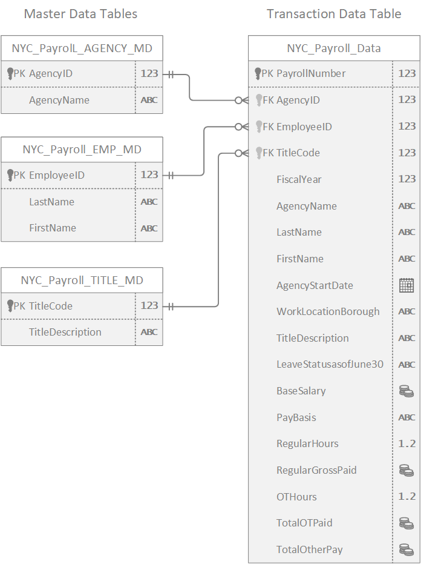
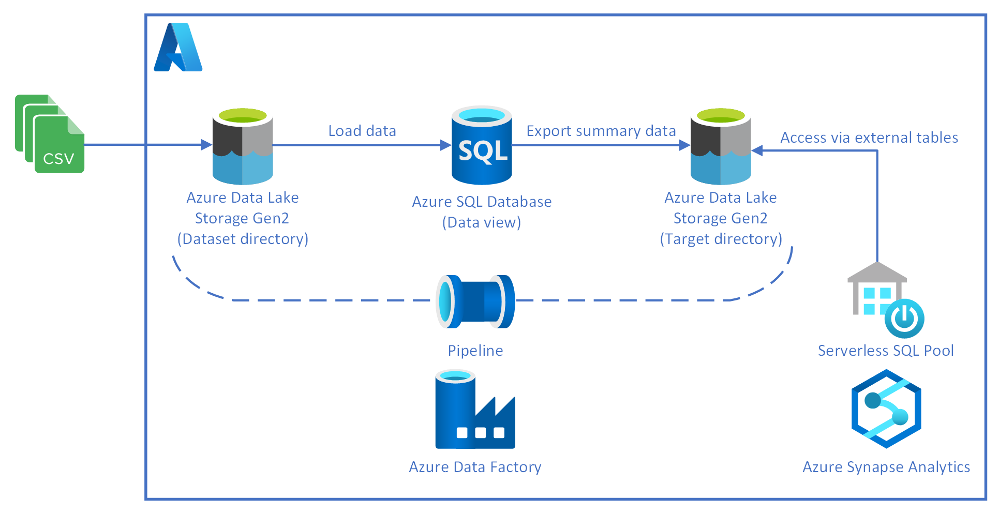

# Azure Data Integration Pipelines for NYC Payroll Data Analytics

The City of New York would like to develop a Data Analytics platform on Azure Synapse Analytics to accomplish two primary objectives:

1.	Analyze how the City's financial resources are allocated and how much of the City's budget is being devoted to overtime.
2.	Make the data available to the interested public to show how the City’s budget is being spent on salary and overtime pay for all municipal employees.

With this project, we aim to create high-quality data pipelines that are dynamic, automated, and monitored for efficient operation.
The source data resides in Azure Data Lake and needs to be processed in a NYC data warehouse. The source datasets consist of CSV files with Employee master data and monthly payroll data entered by various City agencies.

In the following pages, we will go through the project instructions and by the end we will have built a Data Integration Pipelines on the NYC Payroll Data. We will be using Azure Data Factory to create Data views in Azure SQL DB from the source data files in DataLake Gen2. Then we build our dataflows and pipelines to create payroll aggregated data that will be exported to a target directory in DataLake Gen2 storage over which Synapse Analytics external table is built. At a high level the pipeline will look like below:

> Please refer to [Project Implementation Report](<./Project Implementation Report.pdf>) for detailed steps.

> Click [here](https://video.udacity-data.com/topher/2022/May/6283aff5_data-nyc-payroll/data-nyc-payroll.zip) to download the dataset used in the project.